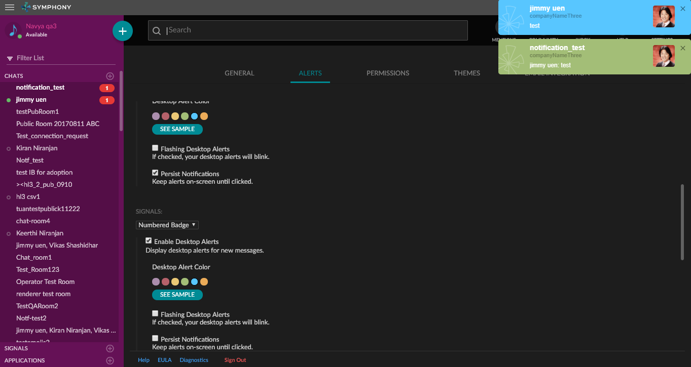
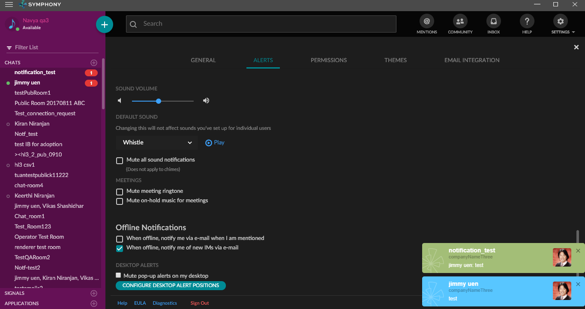

# Intro
The Symphony Electron app supports toast notifications.

# Platforms Supported
macOS, Windows 7, Windows 10

# Purpose
To provide a rich desktop user experience, toast notifications are supported on all the platforms.

# Details
We support the following set of notifications along with badge / taskbar count on Electron.

- IM message
- MIM message
- Room message
- Mentions
- Wall Posts
- Signals

## macOS
macOS notifications are native chrome notifications which appear like any other desktop app notifications on a Mac.
Emojis are supported in the toast.

## Windows
Windows notifications are custom built to support the following use cases:
- Custom Color
- Position in the screen
- Custom screen (in case of multiple displays connected)
- Flash a notification

On Windows 7 & 10, emojis are supported in the toast.

# Example
N/A

# Other Info
N/A
