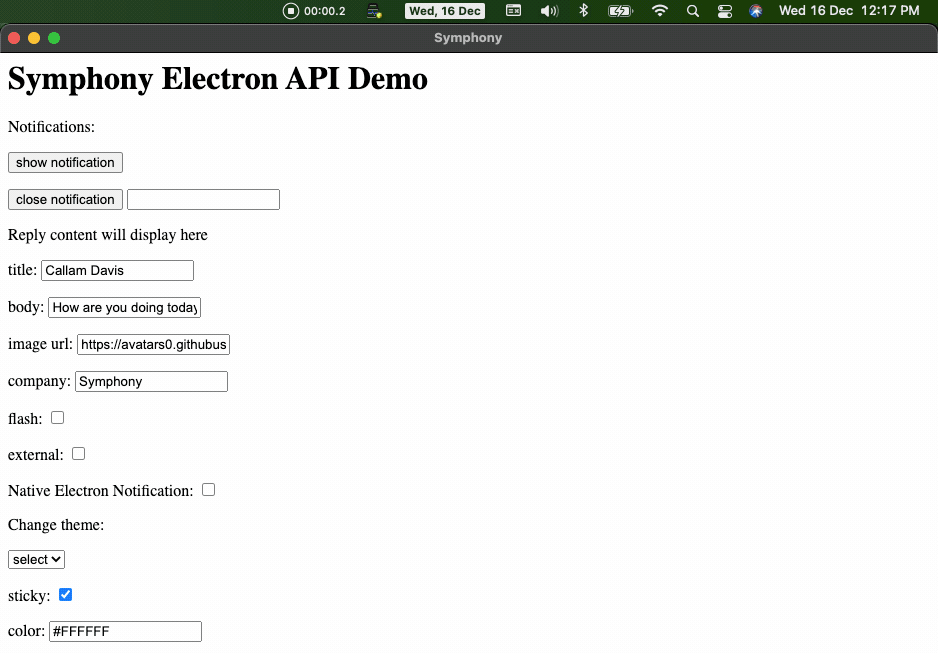

# Intro
The Symphony Electron app supports toast notifications.

# Platforms Supported
macOS, Windows 7, Windows 10

# Purpose
To provide a rich desktop user experience, toast notifications are supported on all the platforms.

# Details
We support the following set of notifications along with badge / taskbar count on Electron.

- IM message
- MIM message
- Room message
- Mentions
- Wall Posts
- Signals

## OS Native notification
We support OS native notifications for users who'd like to keep it simple. This is the same as what you see with toasts in any other apps (on Windows and macOS). Emojis and Quick Replies are supported in the notification.

- Inline reply

## Custom SDA Notification (Windows, macOS, Linux)
Notifications are custom built to support the following use cases:
- Custom Color
- Position in the screen
- Custom screen (in case of multiple displays connected)
- Flashing a notification to call for attention
- Inline reply
- Quick reactions (👍)
- Emojis

# Example
N/A

# Other Info
N/A
