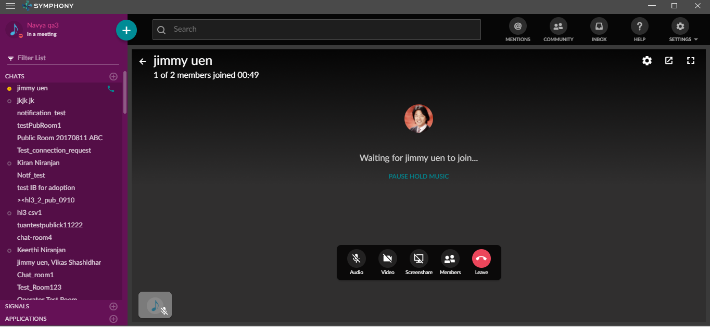
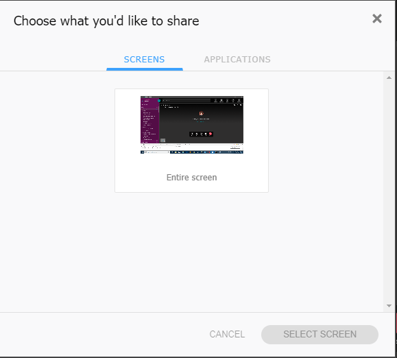
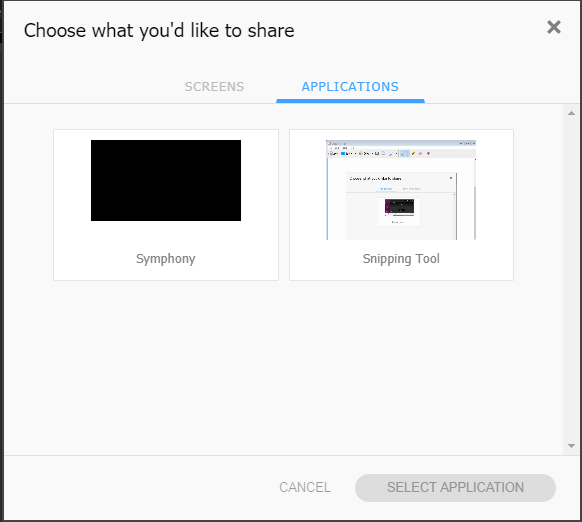

# Intro
Screen sharing allows users to collaborate better when in a meeting

# Platforms Supported
macOS, Windows 10, Windows 7

# Purpose
To allow users to share screen and collaborate when in a meeting

# Details
Screen share allows a user to select from a list of screens and applications in a modal:

- Screens
    - An ability to choose from entire screen or multiple monitors

- Applications
    - An ability to choose from available list of applications

# Examples
N/A

# Other Info
## Electron Implementation
Electron exposes an API getMediaSources which takes two argument options and callback

- Options (Array)
    - screen
    - window
- Callback (Array)
    - sources - All the available screen, monitor and applications (window) as an object with:
        - id (String) - The identifier of a window or screen
        - name (String) - A screen source will be named either Entire Screen or Screen <index>, while the name of a window source will match the window title
        - thumbnail (String) - Base64 encoded png image
## Web App Implementation
In client app, a modal is shown with the list of screens and applications that we get from the electron API
Further, the sources have been segregated into two sections by their name:

- Screens - Entire Screen or Screen <index>
- Applications