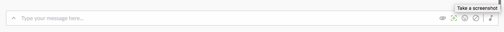
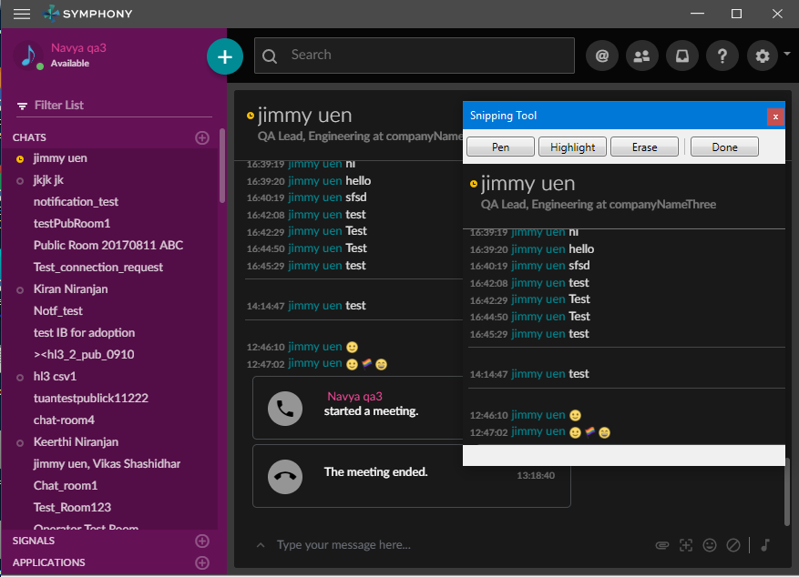

# Intro
The screen snippet feature allows a user to draw a rectangular region on any monitor and capture the area in an image.  The image returned is base64 encoded jpeg image.

# Platforms Supported
macOS, Windows 10, Windows 7

# Purpose
To allow users to capture screenshots instantly from the RTE & share it with their peers.

# Details
## macOS
The Mac OS implementation is using built-in OS feature /usr/sbin/screencapture which has been available since v10.2.

## Windows
Windows has no built-in screen snippet functionality that can be used programmatically.  So, for windows an existing screen snippet utility that was provided as part of minuet wrapper is utilized.  This code has been extracted from minuet and moved into open source project [here](https://github.com/symphonyoss/ScreenSnippet)

Note: This utility is implemented using .NET/WPF technology so requires .NET 3.5 (or higher) to be installed - which comes by default on Windows 7 machines (or higher).

# Examples
N/A

# Other Info
The API is documented [here](https://symphonyoss.atlassian.net/wiki/display/WGDWAPI/ScreenSnippet+API)
