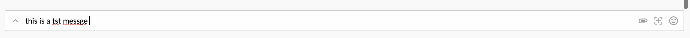
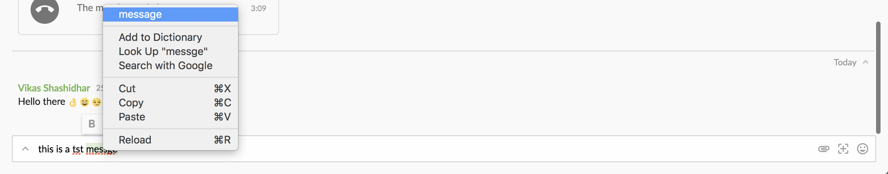

# Intro
Support spell checking when typing in the RTE and offer spelling suggestions similar to Chrome.

# Platforms Supported
macOS, Windows 10, Windows 7

# Purpose
To provide users with grammatical support in the RTE.

# Details
Spell checking happens instantly as the user types their text in the RTE.

Suggestions are offered through a dialog just like how suggestions are offered in Chrome.

The spellchecker on SDA is built using a 3rd party module and supports spell checking only on the main window currently.
Spell checking is only supported for the below mentioned locales

- en-US
- en-GB
- en-CA
- en-AU
- fr-FR

Note: All the above dictionaries will be packaged along with the SDA and automatic download of the dictionary has been disabled

# Examples
N/A

# Other Info
N/A